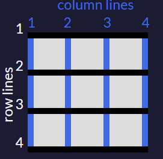

# css-grid

Introduction to the CSS Grid Challenges

- CSS Grid helps you easily build complex web designs. It works by turning an HTML element into a grid container with rows and columns for you to place children elements where you want within the grid.

## 1 - Create Your First CSS Grid :

- Turn any HTML element into a grid container by setting its `display` property to `grid`. This gives you the ability to use all the other properties associated with CSS Grid.

Note: In CSS Grid, the parent element is referred to as the container and its children are called items.

Change the display of the div with the `container` class to `grid`.

## 2 - Add Columns with grid-template-columns :

- Simply creating a grid element doesn't get you very far. You need to define the structure of the grid as well. To add some columns to the grid, use the `grid-template-columns` property on a grid container as demonstrated below:

```css
.container {
  display: grid;
  grid-template-columns: 50px 50px;
}
```

- This will give your grid two columns that are each 50px wide. The number of parameters given to the `grid-template-columns` property indicates the number of columns in the grid, and the value of each parameter indicates the width of each column.

Give the grid container three columns that are each `100px` wide.

## 3 - Add Rows with grid-template-rows :

- The grid you created in the last challenge will set the number of rows automatically. To adjust the rows manually, use the `grid-template-rows` property in the same way you used `grid-template-columns` in previous challenge.

Add two rows to the grid that are `50px` tall each.

## 4 - Use CSS Grid units to Change the Size of Columns and Rows :

- You can use absolute and relative units like px and em in CSS Grid to define the size of rows and columns. You can use these as well:

- `fr`: sets the column or row to a fraction of the available space,

- `auto`: sets the column or row to the width or height of its content automatically,

- `%`: adjusts the column or row to the percent width of its container.

Here's the code that generates the output in the preview:

```css
grid-template-columns: auto 50px 10% 2fr 1fr;
```

- This snippet creates five columns. The first column is as wide as its content, the second column is 50px, the third column is 10% of its container, and for the last two columns; the remaining space is divided into three sections, two are allocated for the fourth column, and one for the fifth.

- Make a grid with three columns whose widths are as follows: 1fr, 100px, and 2fr.

## 5 - Create a Column Gap Using grid-column-gap :

- So far in the grids you have created, the columns have all been tight up against each other. Sometimes you want a gap in between the columns. To add a gap between the columns, use the `grid-column-gap` property like this:

```css
grid-column-gap: 10px;
```

- This creates 10px of empty space between all of our columns.

- Give the columns in the grid a `20px` gap.

## 6 - Create a Row Gap using grid-row-gap :

- You can add a gap in between the rows of a grid using `grid-row-gap` in the same way that you added a gap in between columns in the previous challenge.

Create a gap for the rows that is `5px` tall.

## 7 - Add Gaps Faster with grid-gap :

- `grid-gap` is a shorthand property for `grid-row-gap` and `grid-column-gap` from the previous two challenges that's more convenient to use. If `grid-gap` has one value, it will create a gap between all rows and columns. However, if there are two values, it will use the first one to set the gap between the rows and the second value for the columns.

- Use `grid-gap` to introduce a `10px` gap between the rows and `20px` gap between the columns.

## 8 - Use grid-column to Control Spacing :

- Up to this point, all the properties that have been discussed are for grid containers. The `grid-column` property is the first one for use on the grid items themselves.

- The hypothetical horizontal and vertical lines that create the grid are referred to as lines. These lines are numbered starting with 1 at the top left corner of the grid and move right for columns and down for rows, counting upward.

- This is what the lines look like for a 3x3 grid:
  
- column lines1234row lines1234
  To control the amount of columns an item will consume, you can use the `grid-column` property in conjunction with the line numbers you want the item to start and stop at.

Here's an example:

```css
grid-column: 1 / 3;
```

- This will make the item start at the first vertical line of the grid on the left and span to the 3rd line of the grid, consuming two columns.

- Make the item with the class `item5` consume the last two columns of the grid.

## 9 - Use grid-row to Control Spacing :

- Of course, you can make items consume multiple rows just like you can with columns. You define the horizontal lines you want an item to start and stop at using the grid-row property on a grid item.

- Make the element with the item5 class consume the last two rows.

## 10 - Align an Item Horizontally using justify-self :

- In CSS Grid, the content of each item is located in a box which is referred to as a cell. You can align the content's position within its cell horizontally using the `justify-self` property on a grid item. By default, this property has a value of `stretch`, which will make the content fill the whole width of the cell. This CSS Grid property accepts other values as well:

- `start`: aligns the content at the left of the cell,

- `center`: aligns the content in the center of the cell,

- `end`: aligns the content at the right of the cell.

- Use the `justify-self` property to center the item with the class `item2`.

## 11 - Align an Item Vertically using align-self :

- Just as you can align an item horizontally, there's a way to align an item vertically as well. To do this, you use the `align-self` property on an item. This property accepts all of the same values as `justify-self` from the last challenge.

- Align the item with the class `item3` vertically at the `end`.

## 12 - Align All Items Horizontally using justify-items :

- Sometimes you want all the items in your CSS Grid to share the same alignment. You can use the previously learned properties and align them individually, or you can align them all at once horizontally by using `justify-items` on your grid container. This property can accept all the same values you learned about in the previous two challenges, the difference being that it will move all the items in our grid to the desired alignment.

- Use this property to center all our items horizontally.

## 13 - Align All Items Vertically using align-items :

- Using the `align-items` property on a grid container will set the vertical alignment for all the items in our grid.

- Use it now to move all the items to the end of each cell.

## 14 - Divide the Grid Into an Area Template :

- You can group cells of your grid together into an area and give the area a custom name. Do this by using `grid-template-areas` on the container like this:

```css
grid-template-areas:
  "header header header"
  "advert content content"
  "footer footer footer";
```

- The code above merges the top three cells together into an area named `header`, the bottom three cells into a `footer` area, and it makes two areas in the middle row; `advert` and `content`. Note: Every word in the code represents a cell and every pair of quotation marks represent a row. In addition to custom labels, you can use a period (`.`) to designate an empty cell in the grid.

Place the area template so that the cell labeled `advert` becomes an empty cell.

## 15 - Place Items in Grid Areas Using the grid-area Property :

- After creating an area's template for your grid container, as shown in the previous challenge, you can place an item in your custom area by referencing the name you gave it. To do this, you use the `grid-area` property on an item like this:

```css
.item1 {
  grid-area: header;
}
```

- This lets the grid know that you want the `item1` class to go in the area named `header`. In this case, the item will use the entire top row because that whole row is named as the header area.

- Place an element with the `item5` class in the `footer` area using the `grid-area` property.
